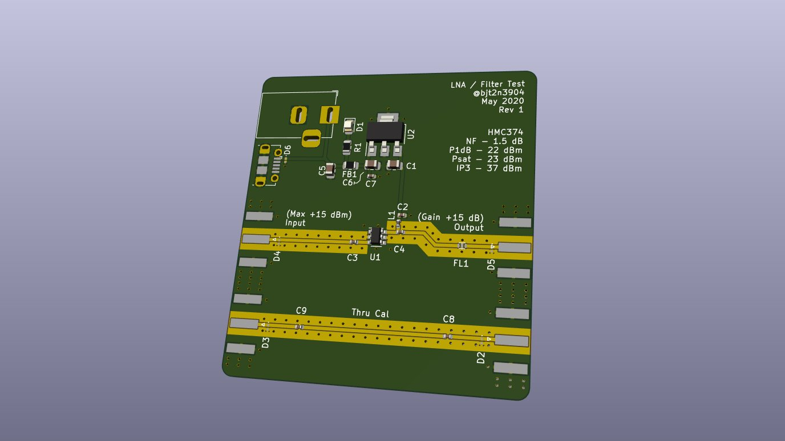

# Public Safety LNA / Bandpass Filter

## Electrical Specification

 * Filter Passband: 729 to 960 MHz
 * Filter Insertion Loss: ~2 dB
 * Input Max: +15 dBm
 * LNA Gain: Approx +15 dB
 * Combined Gain: Approx 13 dB
